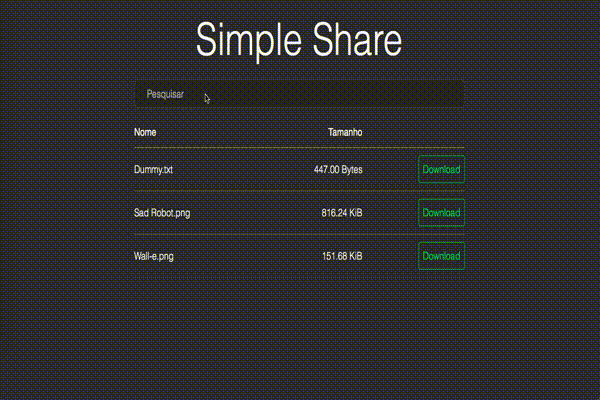

# Simple Local Share

> Compartilhe arquivos na sua rede local de forma simples e rápida.

```shell
git clone https://github.com/grntartaglia/simple-local-share.git
cd simple-local-share
npm install --production && npm start
```

## Compartilhando

Coloque os arquivos que deseja compartilhar dentro da pasta  _share_ e inicie o servidor com `npm start` caso ainda não tenha o feito. Depois é só passar o endereço para as outras pessoas da sua rede.



> [Wall-e](https://dribbble.com/shots/2357921-Wall-e) por [Rogie King](https://dribbble.com/rogie)
